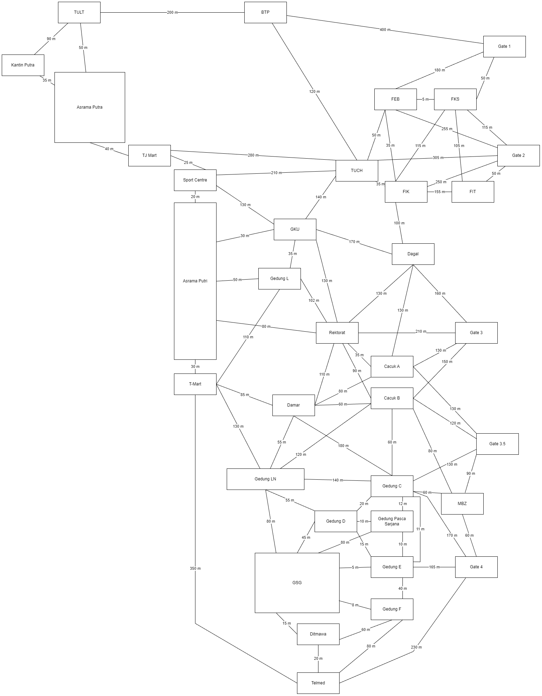

The program will first generate a map of weighted graph predefined in the main function, and then calculate the distances and paths of each starting point and destionation in the input vector.

The current map looks like this

This program is made for Algorithm Complexity's final project.
